

# The two particle density matrix of a Luttinger Liquid

Harini Radhakrishnan, Matthias Thamm, Hatem Barghathi, Bernd Rosenow, and Adrian Del Maestro

[arXiv:XXXX.YYYYY](https://arxiv.org/abs/XXXX.YYYYY)

### Abstract
The $n$-body reduced density matrix ($n$-RDM) characterizes higher order correlations in a many-body system. This quantity can be used to compute any $n$-body observable without direct access to the full wavefunction, and is experimentally measurable. Analytically, the problem of computing higher order density matrices becomes increasingly challenging as the number of coordinates grows. However, within the Luttinger liquid regime, bosonization provides access to correlation functions by representing them as exponentials of bosonic field operators. We outline the derivation of the exact $2$-RDM from bosonization and map it to the $J$-$V$ model of interacting spinless fermions in one dimension, where the low-energy sector can be described by Luttinger liquid theory. We demonstrate that the non-interacting limit reproduces the result predicted by Wick’s theorem and present an analytical result for density-density correlations, allowing for an investigation of the effects of a finite-size lattice. Our results demonstrate agreement with those obtained from density matrix renormalization group calculations. Finally, we discuss the application of our expression for computing the two-body lattice energy and static structure factor. 

### Description
This repository includes links, code, scripts, and data to generate the figures in a paper.

### Requirements
To reproduce the plots of the paper, run the code in the jupyter notebook `generate_figures.ipynb`. This notebook has the following python packages as dependencies:

- `numpy`
- `scipy`
- `matplotlib`

The DMRG simulations were performed using the code in the following repository: <a href="https://github.com/DelMaestroGroup/tV2RDMdmrg_julia">DelMaestroGroup/tV2RDMdmrg_julia</a>

### Support
The creation of these materials was supported in part by the U.S. Department of Energy, Office of Science, Office of Basic Energy Sciences, under Award Number DE-SC0024333.
 
 
### Figures

#### Figure 02: Interaction exponents
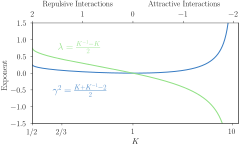

#### Figure 03: Density-density correlations
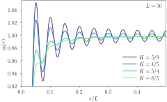

#### Figure 04: Two-RDM
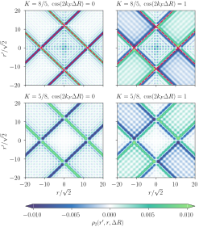

#### Figure 05: Second cumulant
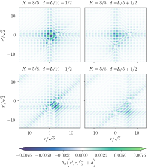

#### Figure 06: Difference between interacting and free fermion two-RDM
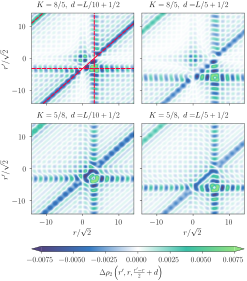

#### Figure 07: Unormalized background-subtracted coherence
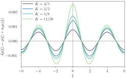

#### Figure 08: Pairing wave function
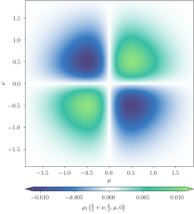

#### Figure 10: One-RDM and two-RDM cut comparison to DMRG
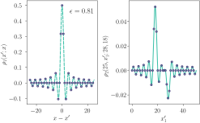

#### Figure 11: Two-RDM cuts comparison to DMRG
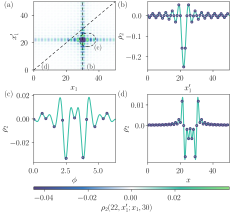

#### Figure 12: Structure factor and pair correlation function
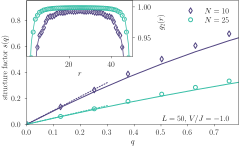 

#### Figure 13: Energies comparison to DMRG
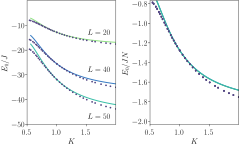